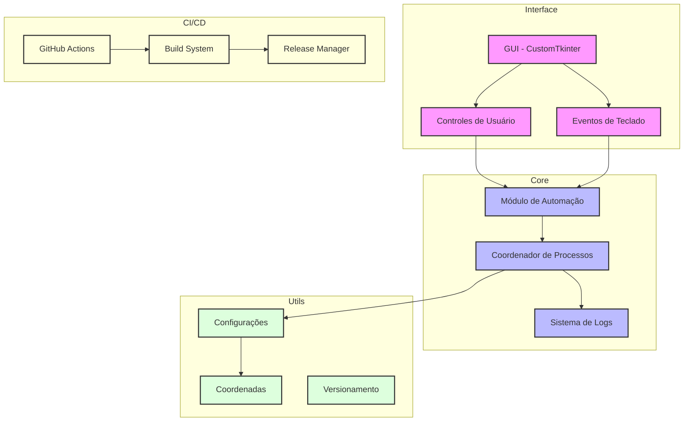

# Arquitetura do Lilica Automator

## Visão Geral

O Lilica Automator foi desenvolvido com uma arquitetura modular e extensível, focando em separação de responsabilidades e facilidade de manutenção.

## Diagrama de Arquitetura

## Componentes Principais

### Interface

- **GUI**: Interface gráfica moderna construída com CustomTkinter
- **Controles**: Gerenciamento de inputs do usuário
- **Eventos**: Captura de atalhos de teclado (CTRL/ALT)

### Core

- **Automação**: Lógica principal usando PyAutoGUI
- **Coordenador**: Gerencia o fluxo de processos
- **Logger**: Sistema de logs para monitoramento

### Utilitários

- **Configurações**: Gerenciamento de configurações
- **Coordenadas**: Armazenamento de posições
- **Versionamento**: Controle de versão

### CI/CD

- **GitHub Actions**: Automação de build e deploy
- **Build System**: Geração de executáveis
- **Release**: Gestão de releases

## Fluxo de Dados

1. Usuário interage com a interface
2. Eventos são capturados e processados
3. Módulo de automação executa ações
4. Sistema de logs registra operações
5. CI/CD gerencia builds e releases
